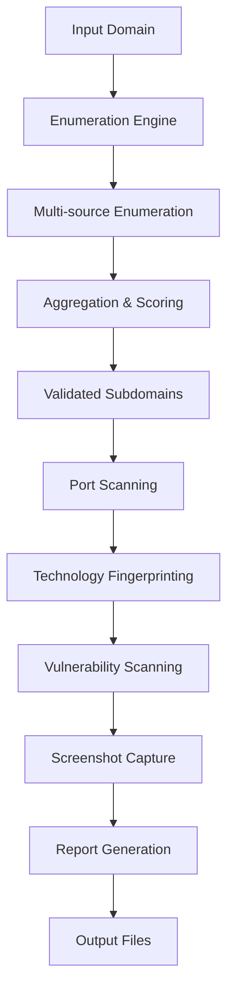

# Architecture Technique - Aegir Smart Reconnaissance Platform

## Vue d'ensemble

Aegir est une plateforme de reconnaissance offensive modulaire et extensible, conçue pour automatiser les workflows de pentesting avec une approche intelligente et validée.

## Architecture Modulaire

### 1. Core Engine (`src/core/`)

#### EnumerationEngine
- **Responsabilité** : Orchestration de l'énumération multi-sources
- **Fonctionnalités** :
  - Agrégation de résultats
  - Scoring intelligent
  - Validation croisée
  - Gestion des erreurs

#### Plugin System
- **Interface** : `BaseEnumerationSource`
- **Sources disponibles** :
  - Certificate Transparency
  - DNS Brute Force
  - Search Engines
  - HackerTarget API

### 2. Modules Spécialisés

#### Port Scanner (`src/modules/port_scanner.py`)
- **Protocole** : TCP/UDP
- **Concurrence** : Async avec rate limiting
- **Détection** : Service fingerprinting basique

#### Technology Fingerprinter (`src/modules/tech_fingerprint.py`)
- **Méthodes** :
  - Headers HTTP
  - Body content analysis
  - JavaScript detection
  - Meta tags parsing

#### Vulnerability Scanner (`src/modules/vuln_scanner.py`)
- **Checks** :
  - Security headers
  - Information disclosure
  - Authentication bypass
  - Configuration issues

#### Screenshot Capture (`src/modules/screenshot_capture.py`)
- **Technologie** : Playwright
- **Features** :
  - Full page capture
  - Multiple viewports
  - JavaScript rendering

### 3. Reporting System

#### Report Generator (`src/modules/report_generator.py`)
- **Formats** : JSON, HTML, YAML
- **Corrélation** : Subdomain → Service → Tech → Vulns
- **Audit trail** : Complete operation log

## Flux de Données



## Configuration

### Structure de Configuration
```yaml
global:
  timeout: 30.0
  max_retries: 3
  rate_limit: 0.1

enumeration:
  sources:
    certificate_transparency:
      enabled: true
      timeout: 15.0
  scoring:
    strict:
      min_confidence: 0.5
      min_sources: 2
```

### Gestion des Configurations
- **Fichier principal** : `config/aegir_config.yaml`
- **Override** : Variables d'environnement
- **Validation** : Schema validation

## Logging et Monitoring

### Système de Logging
- **Structured logging** : JSON format
- **Multi-level** : Console + File + Error logs
- **Performance tracking** : Duration metrics
- **Audit trail** : Complete operation history

### Métriques
- **Performance** : Response times, throughput
- **Quality** : Success rates, error rates
- **Coverage** : Subdomain discovery rates

## Sécurité

### Input Validation
- **Domain validation** : RFC compliance
- **Protocol restrictions** : HTTP/HTTPS only
- **Rate limiting** : Per-source limits
- **Sanitization** : Filename sanitization

### Error Handling
- **Graceful degradation** : Continue on source failure
- **Retry logic** : Exponential backoff
- **Fallback mechanisms** : Alternative sources

## Extensibilité

### Plugin Architecture
```python
class CustomSource(BaseEnumerationSource):
    async def enumerate(self, domain: str) -> List[EnumerationResult]:
        # Implementation
        pass
```

### Configuration Extensions
- **Custom wordlists** : DNS brute force
- **API keys** : External services
- **Custom scoring** : Domain-specific rules

## Performance

### Optimisations
- **Async I/O** : Non-blocking operations
- **Connection pooling** : Reuse connections
- **Caching** : DNS resolution caching
- **Rate limiting** : Prevent overwhelming targets

### Scalability
- **Horizontal scaling** : Multiple instances
- **Load balancing** : Source distribution
- **Resource management** : Memory/CPU limits

## Tests

### Test Structure
```
tests/
├── test_enumeration.py      # Core engine tests
├── test_plugins.py          # Plugin system tests
├── test_modules.py          # Module tests
├── test_integration.py      # End-to-end tests
└── fixtures/                # Test data
```

### Test Types
- **Unit tests** : Individual components
- **Integration tests** : Module interaction
- **Performance tests** : Load testing
- **Security tests** : Input validation

## Déploiement

### Requirements
```txt
aiohttp>=3.8.0,<4.0.0
httpx>=0.24.0,<1.0.0
playwright>=1.35.0,<2.0.0
pytest>=7.3.0,<8.0.0
```

### Installation
```bash
pip install -r requirements.txt
playwright install
```

### Configuration
```bash
cp config/aegir_config.yaml.example config/aegir_config.yaml
# Edit configuration
```

## Monitoring et Maintenance

### Health Checks
- **Service availability** : Source connectivity
- **Performance metrics** : Response times
- **Error rates** : Failure monitoring
- **Resource usage** : Memory/CPU monitoring

### Maintenance
- **Log rotation** : Automatic log management
- **Cache cleanup** : Periodic cache clearing
- **Plugin updates** : Source maintenance
- **Configuration updates** : Dynamic config reload

## Roadmap Technique

### Phase 1 : Stabilisation
- [x] Core architecture
- [x] Basic modules
- [x] Configuration system
- [ ] Comprehensive testing
- [ ] Performance optimization

### Phase 2 : Extension
- [ ] Additional enumeration sources
- [ ] Advanced vulnerability checks
- [ ] Custom scoring algorithms
- [ ] Plugin marketplace

### Phase 3 : Enterprise
- [ ] Multi-tenant support
- [ ] API interface
- [ ] Advanced reporting
- [ ] Integration capabilities

## Author & Development

### Developer
- **Antoine Kojfer (JAK)** : Senior Security Researcher, Offensive Security Specialist
- **Contact** : Available through GitHub Issues
- **Expertise** : Penetration Testing, Security Research, Tool Development

### Code Standards
- **PEP 8** : Python style guide
- **Type hints** : Full type annotation
- **Docstrings** : Comprehensive documentation
- **Tests** : Minimum 80% coverage

### Development Workflow
1. **Fork** : Create feature branch
2. **Develop** : Implement with tests
3. **Test** : Run full test suite
4. **Review** : Code review process
5. **Merge** : Integration to main

### Security Considerations
- **Input validation** : All external inputs
- **Error handling** : No information disclosure
- **Rate limiting** : Respect target resources
- **Logging** : No sensitive data in logs 